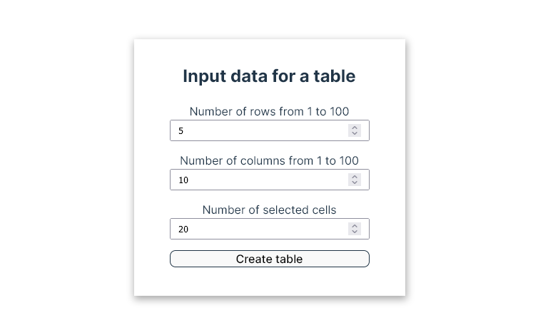
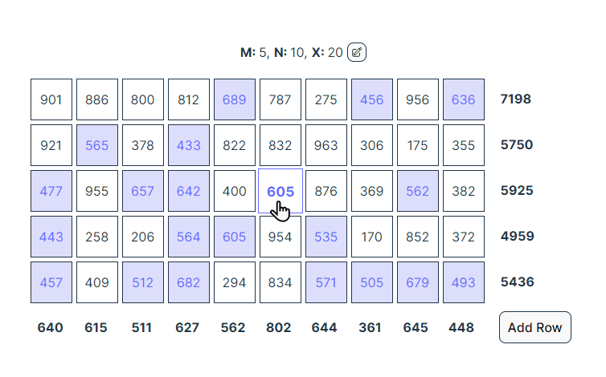

# dynamic-table

Посмотреть приложение - [по ссылке](https://dynamic-table-omega.vercel.app/)

### Технические

**_React_** + **_Typescript_** + **_React Context API_**

### Входящие параметры

\
**M** в диапазоне 1:100\
**N** в диапазоне 1:100\
**X** в допустимом рассчитанном диапазоне

### Вывод таблицы

\
В основных ячейках таблицы выводится `amount`, ранее автоматически сгенерированный, справа сумма по строкам **M**, снизу — среднее по столбцам **N**.

### Динамика ячеек

При нажатии на ячейку увеличивается значение `amount` на 1 и соответственно меняется среднее этого столбика и сумма этой строки.\
При наведении на ячейку подсвечивается **X** ячеек, amount которых самый близкий к `amount` текущей ячейки.\
При наведении на ячейку суммы по строчке заменяются значением ячеек на процент их вклада в общую сумму и добавляется фон: столбик, который наглядно показывает величину процента.

### Динамика строк

Можно удалить строку с таблицы, при этом меняется средние значения по каждому столбику.

### Фичи

Можно добавить строку, фактически **M**+1. При этом строка заполняется по всем правилам таблицы.

## Доступные скрипты

### `yarn dev`

Запускает приложение в режиме разработки.\
Откройте [http://localhost:5173](http://localhost:5173) чтобы просмотреть его в браузере.

### `yarn build`

Создает приложение в папке `dist`.
